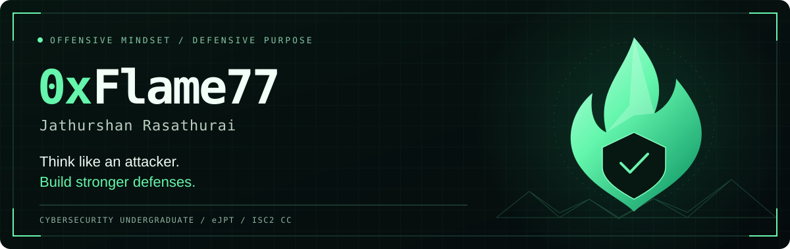

  

  <a href="https://jathurshan-r.github.io"><b>PORTFOLIO ↗</b></a> &nbsp; · &nbsp;
  <a href="https://www.linkedin.com/in/jathurshan-rasathurai"><b>LINKEDIN</b></a> &nbsp; · &nbsp;
  <a href="https://tryhackme.com/p/0xFlame77"><b>TRYHACKME</b></a> &nbsp; · &nbsp;
  <a href="https://app.hackthebox.com/users/2170950"><b>HACK THE BOX</b></a>

<b>eJPT certified · ISC2 CC · Cybersecurity undergraduate at SLIIT</b> Sri Lanka · Open to cybersecurity internships and junior opportunities

---

### 01 / Behind the alias

I'm **Jathurshan**, a cybersecurity undergraduate working towards a career in **penetration testing and offensive security**, with an interest in SOC analysis and how defenders detect attacks.

I learn through hands-on labs, build tools to understand how systems work, and document the reasoning behind my findings. My current focus is **web application security, Linux privilege escalation, and DevSecOps**.

**Enumerate carefully. Validate findings. Document clearly.**

### 02 / Selected work

| Project | What you'll find | My role |
| :--- | :--- | :--- |
| **[Python Port Scanner ↗](https://github.com/JATHURSHAN-R/py-port-scanner)** | Concurrent TCP connect scanning, protocol-aware banner grabbing, and JSON/HTML reports. | Personal project |
| **[DVWA DevSecOps ↗](https://github.com/JATHURSHAN-R/IE3142-DVWA-DevSecOps)** | Application remediation and CI security scanning with Semgrep, Composer audit, Gitleaks, and Trivy. | Academic team lead; SQL injection remediation, platform integration, build validation, and container scanning |
| **[Northwind CTF ↗](https://github.com/JATHURSHAN-R/northwind-ctf)** | Six-stage learning environment covering OSINT, steganography, web security, cryptography, packet analysis, and Linux security. | Academic team contributor |
| **[Cybersecurity Portfolio ↗](https://github.com/JATHURSHAN-R/jathurshan-r.github.io)** | My projects, achievement evidence, and lab writeups, with selected HTB statistics refreshed through GitHub Actions. | Personal portfolio |

### 03 / Hands-on practice

<table>
<tr>
<td width="50%" valign="top">

**TRYHACKME / 0xFlame77**

**Top 2%** globally · **Guru**

**169** rooms completed · **31** badges

Profile snapshot: 30 September 2026.

[Explore my THM profile →](https://tryhackme.com/p/0xFlame77)

</td>
<td width="50%" valign="top">

**HACK THE BOX / JATHURSHAN77**

Machine labs, enumeration, web security, and Linux privilege escalation.

My portfolio refreshes **system owns, user owns, solved challenges, and recent machine activity every six hours**.

[See the latest synced progress →](https://jathurshan-r.github.io/#achievements)

</td>
</tr>
</table>

### 04 / Technical toolkit

| Area | Tools & technologies |
| :--- | :--- |
| **Security testing** | Nmap · Burp Suite · Metasploit · Wireshark |
| **Programming** | Python · SQL · Java · C |
| **Systems & networking** | Linux · Kali Linux · TCP/IP · HTTP · Socket programming |
| **DevSecOps** | Git · GitHub Actions · Docker Compose · Semgrep · Trivy · Gitleaks · Composer audit |

### 05 / Certifications & field notes

**eJPT — INE Junior Penetration Tester** · 2026  
**ISC2 Certified in Cybersecurity (CC)** · 2026

I document the steps, decisions, and lessons behind my lab work:

- [Nexus — lab writeup (PDF)](https://github.com/JATHURSHAN-R/cybersecurity-writeups/blob/main/HTB/Nexus_Story.pdf)
- [TwoMillion — lab writeup (PDF)](https://github.com/JATHURSHAN-R/cybersecurity-writeups/blob/main/HTB/TwoMillion_Story.pdf)
- [Browse all published writeups →](https://github.com/JATHURSHAN-R/cybersecurity-writeups)

---

  <b>Let's build something secure.</b> 
  Interested in internships, junior roles, and learning with other security practitioners.  
  <a href="https://jathurshan-r.github.io">Explore my work</a> &nbsp; / &nbsp;
  <a href="https://www.linkedin.com/in/jathurshan-rasathurai">Connect on LinkedIn</a>

0xFlame77 · Learn. Build. Document.

